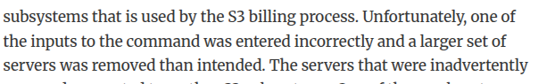

# Autópsia: Disrupção de Serviço AWS S3 | 28 de Fevereiro de 2017

**Autor:** Guilherme Luiz de Azevedo [@GuiAzevedo04](https://github.com/GuiAzevedo04)
**Fonte primaria:** [Summary of the Amazon S3 Service Disruption in the Northern Virginia (US-EAST-1) Region](https://aws.amazon.com/message/41926/)
**Data de acesso:** 30/08/2026

## 1. O que aconteceu

Na manhã do dia 28/02 de 2017 um funcionário autorizado da AWS estava fazendo uma investigação
de rotina em um serviço da AWS que estava calculando mais devagar do que devia os cálculos de cobrança.
Para isso ele rodou um comando que removia uma quantidade pequena de servidores do serviço de cálculo de cobrança,
porém a ferramenta removeu mais servidores do que devia, fazendo o AWS S3, EC2, e Block Storage pararem de funcionar
assim como a própria ferramenta de atualização de status do serviço. O relatório não informa quando eles perceberam a falha, só diz que até as 11:37 eles nem conseguiam avisar os clientes, porque o painel de status também dependia do S3, o que por si só já indica uma falha. No mesmo dia, por volta de 1:18 da tarde a leitura e a remoção de arquivos (GET, LIST e DELETE) estavam operantes novamente, com a gravação de arquivos novos (PUT) voltando as 13:54.

## 2. Qual das Tres Vias falhou

O que falhou foi o fluxo, a ferramenta, que por mais que estivesse sendo usada em um playbook autorizado, era muito permissiva e possibilitou esse erro por conta de um erro humano de digitação. Ou seja, o gatilho foi o erro de digitação, a causa raiz foi existir essa possibilidade sem nenhum tipo de barreira automática.

> "Unfortunately, one of the inputs to the command was entered incorrectly and a larger set of servers was removed than intended."

## 3. Quais metricas DORA teriam denunciado antes

Tempo de restauração, no documento é dito que eles não haviam reiniciado esses sistemas a muitos anos, então ficaram surpresos com o tempo que levou para ele reiniciar. Se tivessem testado isso anteriormente, isso não teria sido um problema.
Sobre a métrica, ela não existe e isso já é um problema, eles não tinham essa medição para comparação, ela nem é citada no relatório. O número que denunciava o risco antes de 28/02 é justamente esse: não havia tempo de restauração medido para um reinício completo do index, porque a última vez que isso foi feito nas regiões grandes tinha sido anos antes quando haviam muito menos clientes na plataforma.

A frequência de implantação denuncia a mesma coisa por outro lado: se a operação de reinício era executada praticamente nunca, ninguém sabia quanto ela demorava nem se ela funcionava na escala atual. É o mesmo mecanismo da aula, procedimento raro nunca fica bom, e o tempo alto de recuperação é consequência disso.

## 4. Qual pratica do semestre teria evitado -- e em que semana

Kubernetes II (Semana 11).

O Kubernetes te permite configurar o sistema, com PodDisruptionBudget e o número mínimo de réplicas no Deployment, para que uma operação que deixaria uma quantidade menor de serviços do que um threshold mínimo para operação não possa ser executada. O cluster simplesmente recusa a remoção. É justamente a alteração que a AWS diz ter feito na ferramenta depois do incidente: barrar a remoção de capacidade que levaria um subsistema abaixo do mínimo necessário. Aplicado ao caso, o comando com o input errado teria sido rejeitado antes de derrubar o index e o placement.

## 5. A cultura do relatorio: generativa ou patologica?

Generativa:

"We are making several changes as a result of this operational event. While removal of capacity is a key operational practice, in this instance, the tool used allowed too much capacity to be removed too quickly. We have modified this tool to remove capacity more slowly and added safeguards to prevent capacity from being removed when it will take any subsystem below its minimum required capacity level. This will prevent an incorrect input from triggering a similar event in the future. We are also auditing our other operational tools to ensure we have similar safety checks. We will also make changes to improve the recovery time of key S3 subsystems. We employ multiple techniques to allow our services to recover from any failure quickly. One of the most important involves breaking services into small partitions which we call cells. By factoring services into cells, engineering teams can assess and thoroughly test recovery processes of even the largest service or subsystem. As S3 has scaled, the team has done considerable work to refactor parts of the service into smaller cells to reduce blast radius and improve recovery."

Estão aplicando diversas mudanças em várias partes de vários serviços.
